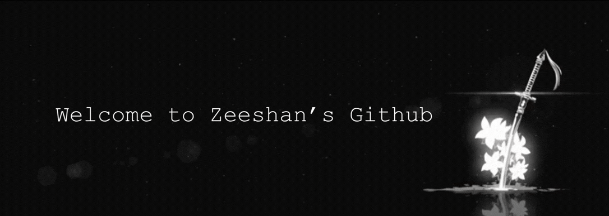

---

<h3>Connect with me</h3>

---

<h2>About me</h2>

I’m a 3rd-year Computer Science student specializing in Data Science, with a strong interest in building data-driven applications and scalable software solutions. I enjoy turning complex problems into practical, real-world systems.

I'm currently working on Building data science projects, machine learning models, and full-stack applications to strengthen my real-world development and analytical skills.
I'm currently learning Data Science, Machine Learning, Python, SQL, Statistics, System Design, and modern web technologies.
Ask me about Python, Data Science, Machine Learning basics, SQL, Data Analysis, and Web Development fundamentals.
I'm looking to collaborate on Data science projects, machine learning applications, open-source contributions, and beginner-friendly research or product ideas.
Hobbies: Exploring new technologies, solving coding challenges, reading about AI, and working on personal tech projects.
How to reach me: zeeshann2204@gmail.com

 

**Data Science Enthusiast**  
**Building web apps with React**  
**Exploring data-driven solutions**  
**Strong GitHub collaboration mindset**

---

  
  
<h2>Technologies</h2>

<h3>Core Technologies</h3>

 

<h3>Frameworks & Libraries</h3>

 

<h3>Team Collaboration</h3>

Experienced in team development using **GitHub**, pull requests, code reviews, and structured workflows.

---

<h2>Statistics</h2>

<table>
<tr>
<td width="50%" align="center">
  <h4>Most Used Languages</h4>
  
</td>
<td width="50%" align="center">
  <h4>GitHub Stats</h4>
  
</td>
</tr>
</table>

<h3>Contribution Streak</h3>

<h3>Contribution Graph</h3>

---

<h3>Random Dev Quote</h3>

---

<h3>Visitor Count</h3>

---

⭐️ From <a href="https://github.com/zeeshan2204">Zeeshan</a> with ❤️

